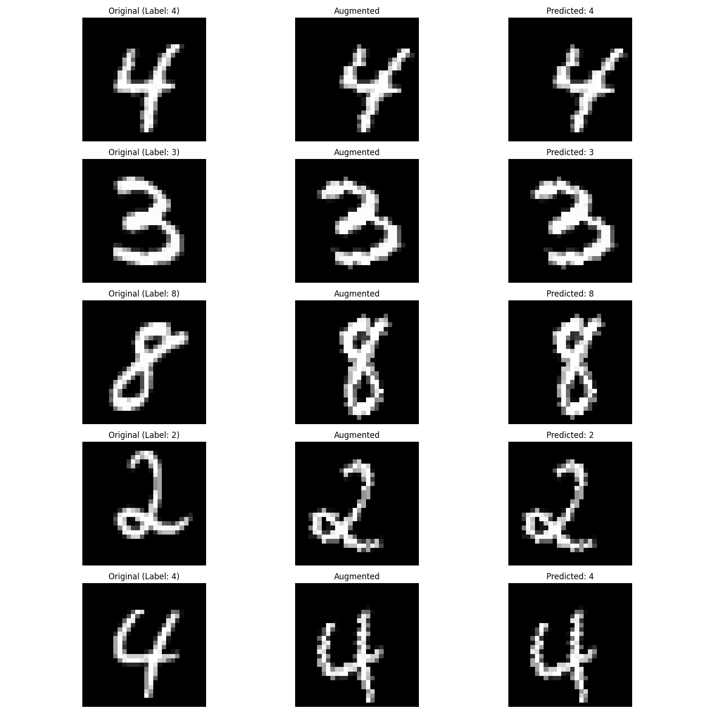

# MNIST Model CI/CD Pipeline

This project demonstrates a CI/CD pipeline for training and testing a CNN model on the MNIST dataset.

## Project Structure 

├── mnist_model.py # Main model implementation
├── test_mnist_model.py # Test cases
├── requirements.txt # Project dependencies
└── .github/workflows # CI/CD pipeline configuration

## Local Setup

1. Create a virtual environment:

```bash:README.md
python -m venv venv
source venv/bin/activate  # On Windows: venv\Scripts\activate
```

2. Install dependencies:

```bash:README.md
pip install -r requirements.txt
```

3. Run tests:

```bash:README.md
pytest test_mnist_model.py -v
```

4. Train model:

```bash:README.md
python mnist_model.py
```

## CI/CD Pipeline

The project includes a GitHub Actions workflow that:
1. Sets up Python environment
2. Installs dependencies
3. Runs tests
4. Trains the model
5. Saves the trained model as an artifact

## Model Details

- Architecture: Simple CNN for MNIST classification
- Input: 28x28 grayscale images
- Output: 10 classes (digits 0-9)
- Training: Uses Adam optimizer and CrossEntropyLoss

## Example Images

The model's performance can be visualized using the generated example images. Below is a sample output showing:
- Original MNIST digits (left column)
- Augmented versions with random rotations and translations (middle column)
- Model predictions on the augmented images (right column)



Each row represents a different digit from the MNIST dataset. The augmentation process applies:
- Random rotations up to 30 degrees
- Random translations up to 20% in both directions

The rightmost column shows the model's predictions on the augmented images, demonstrating its robustness to these transformations.

## Steps to run locally:
1. Create a new directory for your project and copy all the files above into it with the correct structure:

mkdir mnist_pipeline
cd mnist_pipeline
# Copy all files maintaining the structure shown in README.md

2. Create and activate a virtual environment:

```
python -m venv venv
source venv/bin/activate  # On Windows: venv\Scripts\activate
```

3.Install dependencies:

```
pip install -r requirements.txt
```

4. Run tests:

```
pytest test_mnist_model.py -v
```
5. Train model:

```
python mnist_model.py
```
6. Run the following command to check the model's performance:

```
python test_mnist_model.py
```


# Steps to push to GitHub

1. Create a new repository on GitHub
2. Push the local project to the remote repository:

```
git init
git add .
git commit -m "Initial commit"
git branch -M main
git remote add origin <your-repository-url>
git push -u origin main
```

* The GitHub Actions workflow will automatically start when you push to the main branch. You can monitor the progress in the "Actions" tab of your GitHub repository.


## Key features of this setup:

1. The model file is saved with a timestamp suffix for tracking when it was trained
2. GitHub Actions automatically runs tests and training
3. The trained model is saved as an artifact in the GitHub Actions workflow
4. The pipeline checks both model architecture and performance
5. The .gitignore file prevents unnecessary files from being committed

## The pipeline will ensure that:
1. The model meets the parameter count requirement (<25000 parameters)
2. The model achieves the required accuracy (>95%)
3. The model architecture is correct (proper input/output shapes)
4. All tests pass before deployment
5. You can access the trained model artifacts from the GitHub Actions page after each successful run.

## GitHub Setup Instructions

1. Go to your GitHub account settings
2. Navigate to "Settings" → "Developer settings" → "Personal access tokens" → "Tokens (classic)"
3. Generate a new token with the following permissions:
   - `repo` (Full control of private repositories)
   - `workflow` (Update GitHub Action workflows)
4. Copy the generated token

Then update your remote repository URL with the token:

```bash
git remote set-url origin https://<YOUR-TOKEN>@github.com/<USERNAME>/<REPOSITORY>.git
```

Replace:
- <YOUR-TOKEN> with the token you just generated
- <USERNAME> with your GitHub username
- <REPOSITORY> with your repository name